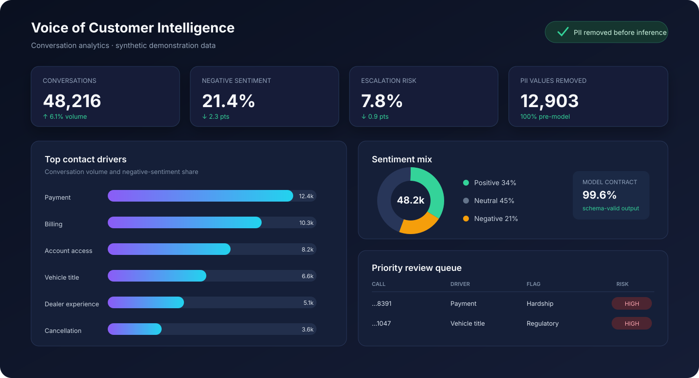
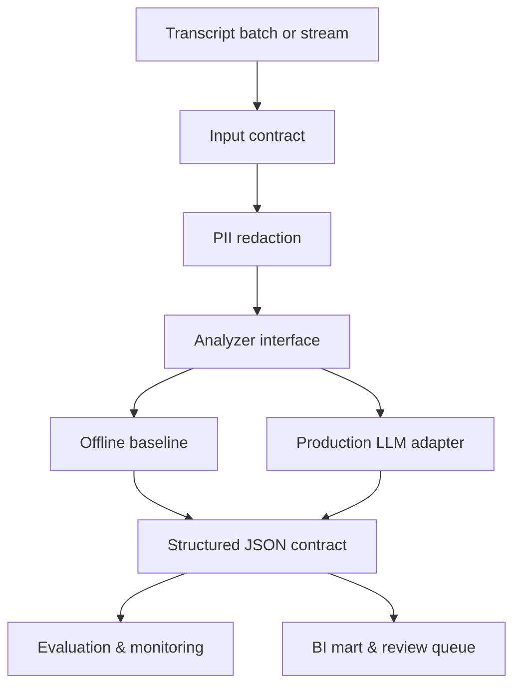

# Contact Center AI Analytics

[](https://github.com/Wizc1998/contact-center-ai-analytics/actions/workflows/ci.yml)


A privacy-first, evaluation-driven pipeline for converting contact-center transcripts into structured Voice of Customer analytics. It detects contact drivers, sentiment, urgency, resolution, escalation risk, and policy-sensitive themes—then publishes governed records for BI.

> **Data note:** every conversation in this repository is synthetic. Names and contact details are fictional test fixtures.



## Why this is more than an LLM demo

A prompt that summarizes one transcript is not an analytics system. A useful production design must make privacy, output contracts, fallback behavior, traceability, evaluation, and downstream metric definitions explicit.

This repository demonstrates that surrounding system:

- PII is redacted **before** text reaches an analyzer;
- a stable `Analyzer` protocol supports both an offline baseline and an injected model provider;
- outputs follow a versionable JSON Schema rather than free-form prose;
- every record carries a deterministic trace ID and analyzer version;
- a labeled evaluation harness reports accuracy and per-class precision/recall/F1;
- aggregate results feed an operations and Voice of Customer dashboard.

## Architecture



## Analysis contract

Each conversation produces decision-ready fields:

| Field | Example | Operational use |
|---|---|---|
| `topic` | `payment` | driver trends and routing |
| `sentiment` | `negative` | customer-friction monitoring |
| `urgency` | `high` | queue prioritization |
| `resolved` | `false` | first-contact-resolution analysis |
| `escalation_risk` | `true` | supervisor review queue |
| `drivers` | `["autopay", "due date"]` | explainability and drill-through |
| `policy_flags` | `["financial_hardship"]` | specialized handling workflows |
| `confidence` | `0.84` | thresholding and human review |

The machine-readable contract lives at [`schemas/analysis.schema.json`](schemas/analysis.schema.json).

## Run locally

The core pipeline has no third-party runtime dependency:

```bash
git clone https://github.com/Wizc1998/contact-center-ai-analytics.git
cd contact-center-ai-analytics
make analyze
make evaluate
make test
```

`make analyze` creates:

- `output/analyses.jsonl` — row-level, redacted, structured results;
- `output/summary.json` — topic, sentiment, redaction, and escalation aggregates.

Launch the optional dashboard:

```bash
python -m pip install -e '.[dashboard]'
make dashboard
```

## Privacy boundary

The pipeline removes common sensitive patterns before inference:

```text
"Email alex@example.test or call 214-555-0199"
                       ↓
"Email [EMAIL] or call [PHONE]"
```

Supported detectors include email, phone, SSN, payment-card-like sequences, and labeled account numbers. Redaction counts are retained for monitoring, but original values are not written to analysis output.

## Evaluation

```bash
make evaluate
```

The included benchmark reports:

- accuracy and macro F1;
- per-topic precision, recall, F1, and support;
- deterministic results suitable for CI regression gates.

The offline baseline scores `1.00` macro F1 on the included 14-case synthetic fixture. That is a **unit benchmark, not a real-world quality claim**: the examples are intentionally compact and separable. Its purpose is to verify the evaluation framework and detect regressions. A production rollout should add manually labeled, representative conversations, confidence calibration, subgroup slices, and side-by-side model comparisons.

## Model strategy

`BaselineAnalyzer` is deliberately transparent and key-free. It provides:

- deterministic CI behavior;
- a safe fallback when a remote model is unavailable;
- a measurable floor for any more capable model;
- interpretable driver matches for debugging.

A production model adapter only needs to implement:

```python
class Analyzer(Protocol):
    def analyze(self, text: str) -> Analysis: ...
```

This keeps vendor SDKs outside the domain pipeline and makes model migration or A/B testing straightforward.

## Repository map

```text
├── src/contact_center_ai/
│   ├── redact.py            # pre-inference PII boundary
│   ├── baseline.py          # deterministic fallback analyzer
│   ├── pipeline.py          # batch orchestration and trace IDs
│   ├── evaluation.py        # precision, recall, F1, accuracy
│   └── models.py            # stable analyzer contract
├── schemas/                 # versionable structured output schema
├── data/                    # synthetic calls and labeled fixture
├── tests/                   # privacy, behavior, batch, evaluation tests
├── app.py                   # optional Streamlit/Plotly dashboard
└── .github/workflows/ci.yml
```

## Production extension points

- ingest speech-to-text events from a queue while preserving call segments;
- use a model gateway with retry, timeout, cost, and schema-validation policies;
- encrypt transient data and enforce retention/deletion policies;
- monitor drift, null rates, confidence, latency, and token cost;
- write curated facts to Snowflake and publish a governed Power BI semantic model;
- connect review decisions back into the labeled evaluation set.

---

Built by [Chase Cai](https://github.com/Wizc1998) to demonstrate applied AI, privacy-aware pipeline design, evaluation, and BI delivery.

